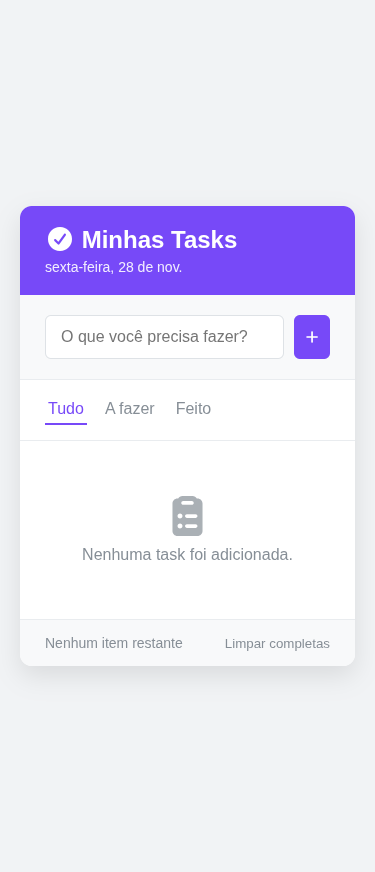
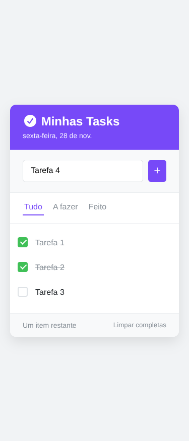
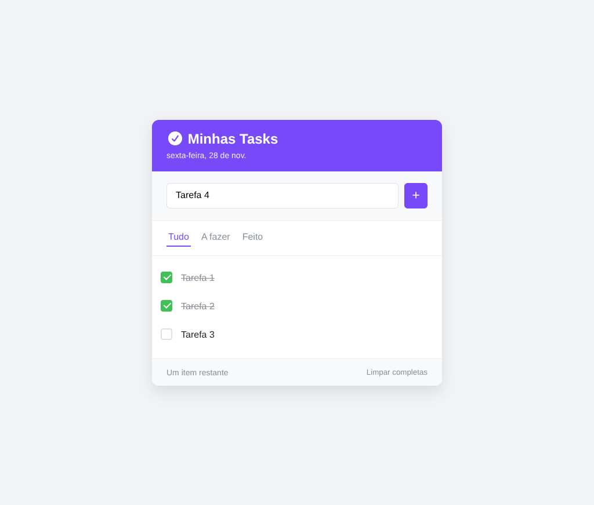
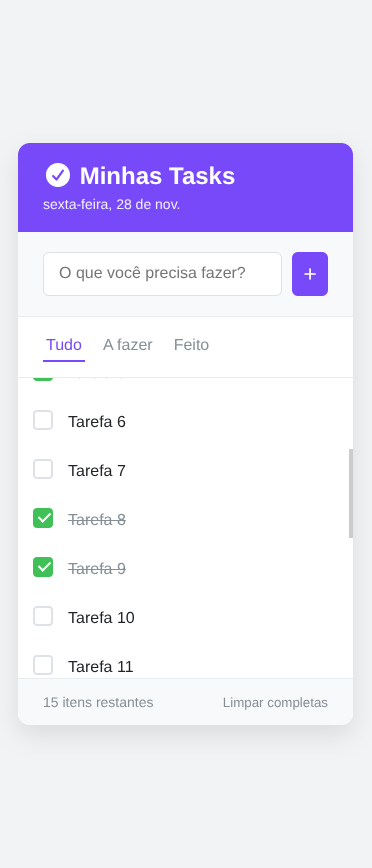
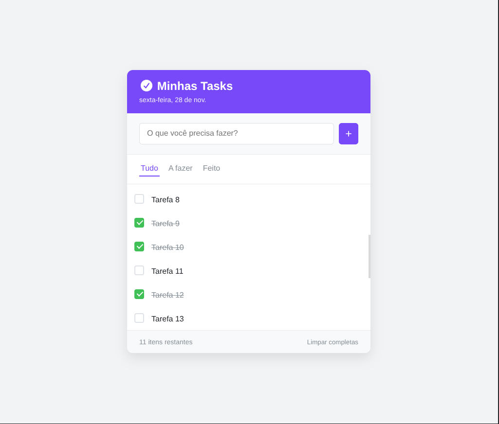
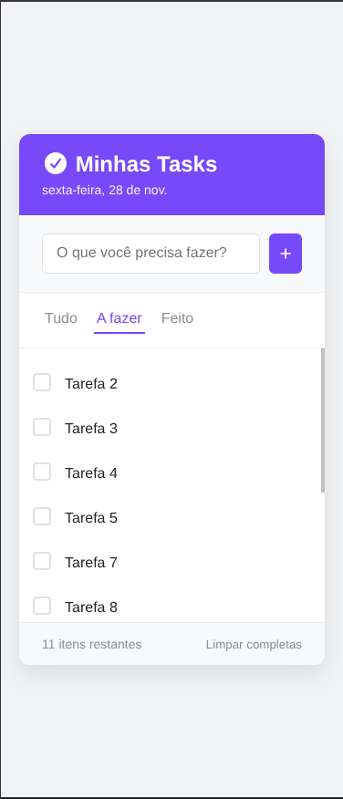
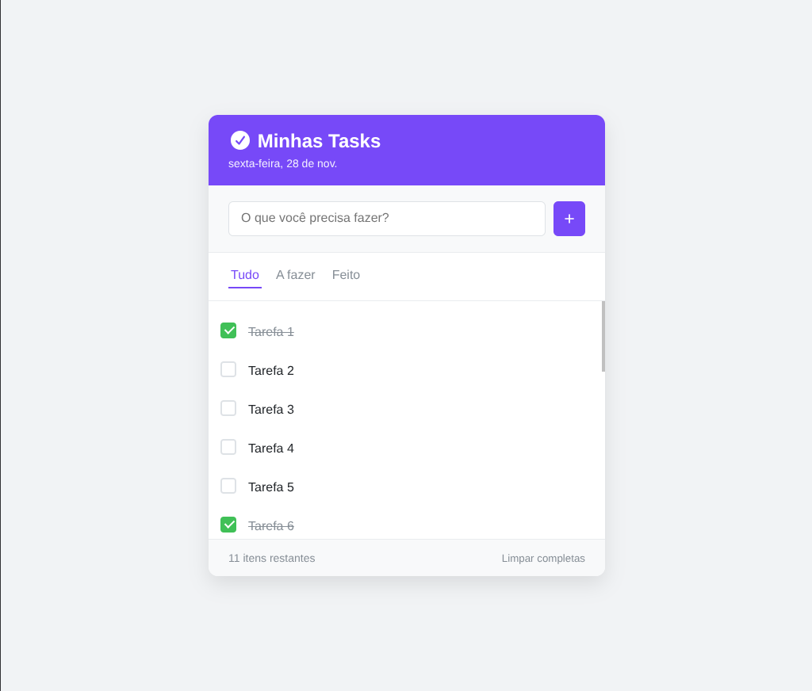
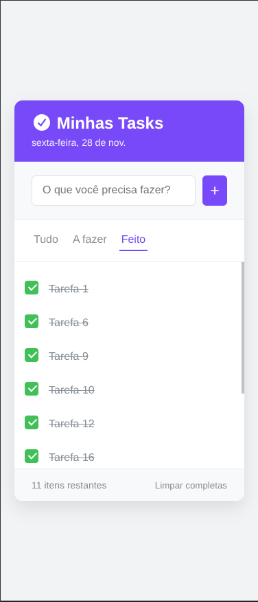
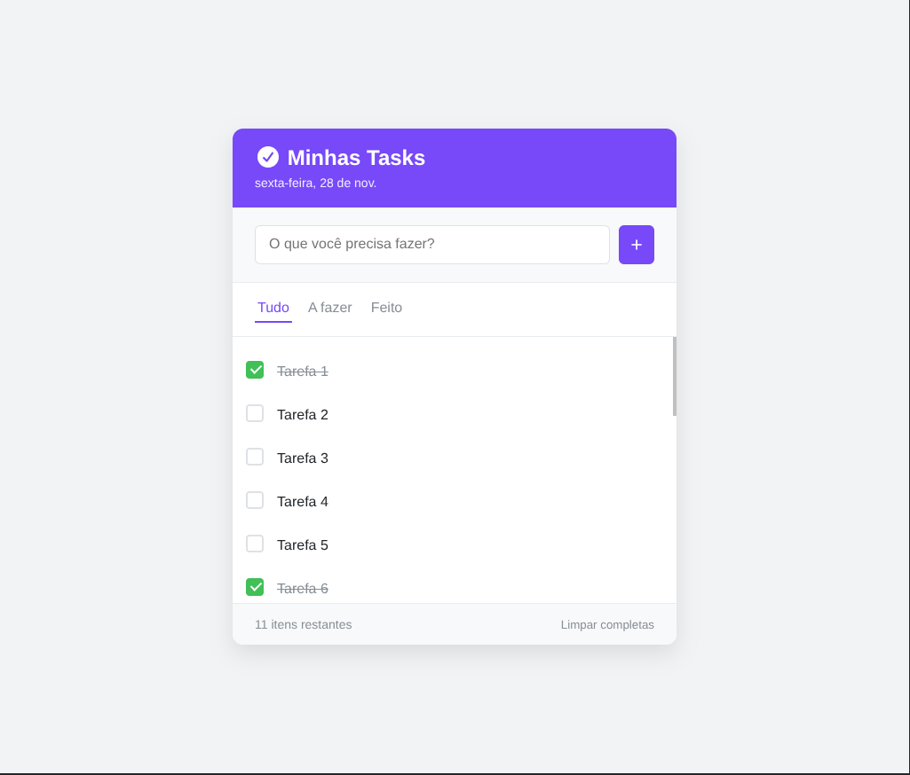

# ✅ ToDo App

## 📚 Sumário
- [📝 Sobre o Projeto](#-sobre-o-projeto)
- [✨ Funcionalidades Principais](#-funcionalidades-principais)
- [🚀 Próximos Passos (Funcionalidades Futuras)](#-próximos-passos-funcionalidades-futuras)
- [🛠️ Tecnologias](#️-tecnologias)
- [💻 Como Rodar Localmente](#-como-rodar-localmente)
- [📸 Demonstração](#-demonstração)

---

## 📝 Sobre o Projeto
Cansado de ter que criar conta e fazer login só pra anotar uma tarefa? Eu também!

Foi por isso que criei este ToDo App. É uma ferramenta simples e funcional feita com **HTML, CSS e JavaScript** que resolve o problema de **gerenciar tarefas diárias sem enrolação.**

A ideia é: **abriu, usou.** Suas tarefas ficam salvas direto no seu navegador, sem burocracia, para você focar só no que importa: **ser produtivo.**

---

## ✨ Funcionalidades Principais
- Adicionar novas tarefas.
- Marcar/Desmarcar tarefas como completas.
- Filtrar tarefas: **`Todas`**, **`A Fazer`** e **`Feito`**.
- Excluir tarefas individuais.
- Limpar todas as tarefas concluídas.
- Salvar os dados no localStorage do navegador para persistência.

---

## 🚀 Próximos Passos (Funcionalidades Futuras)
O foco agora é em **"levar suas tarefas com você"** de forma prática:

- **Exportação/Importação Cross-Environment**: Adicionar a funcionalidade de gerar um **link ou QR Code** que encapsule suas tarefas.

- **Uso Prático**: Se você salvou algo no PC e precisa sair, basta escanear o QR Code no celular para **importar** instantaneamente todas as tarefas no novo dispositivo.


## 🛠️ Tecnologias
- HTML
- CSS
- JavaScript

## 💻 Como Rodar Localmente
Se preferir rodar o projeto em sua máquina, siga os passos abaixo:

1. Clone o repositório:
```bash
git clone https://github.com/uallace-macedo/todoapp.git
```

2. Abra o arquivo **`index.html`** em qualquer navegador.

## 📸 Demonstração

- **`Main clean [Mobile & Desktop]`**
  <div>
    
    
  </div>

- **`Main Tasks`**
  <div>
    
    
  </div>

- **`Main Multiple Tasks [Mobile & Desktop]`**
  <div>
    
    
  </div>

- **`Main Todo Filter Tasks [Mobile & Desktop]`**
  <div>
    
    
  </div>

- **`Main Done Filter Tasks [Mobile & Desktop]`**
  <div>
    
    
  </div>
